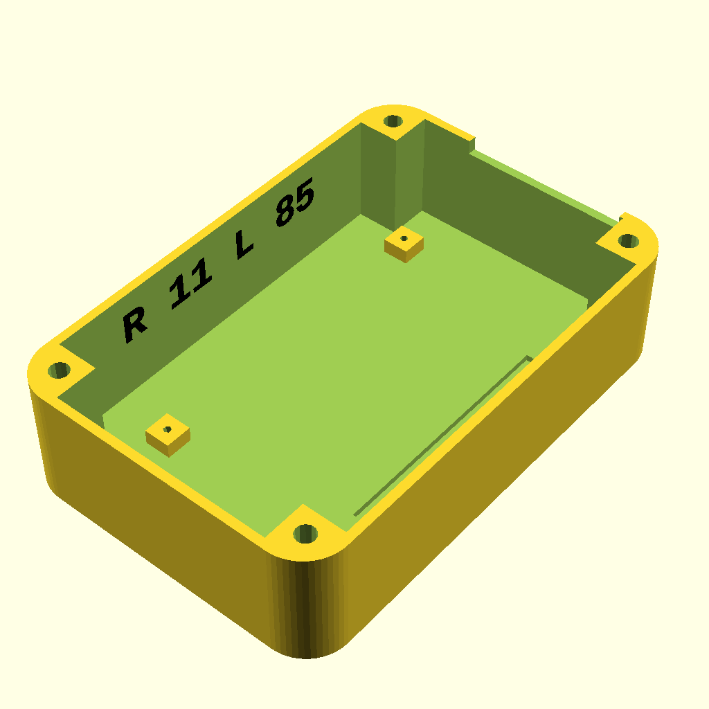
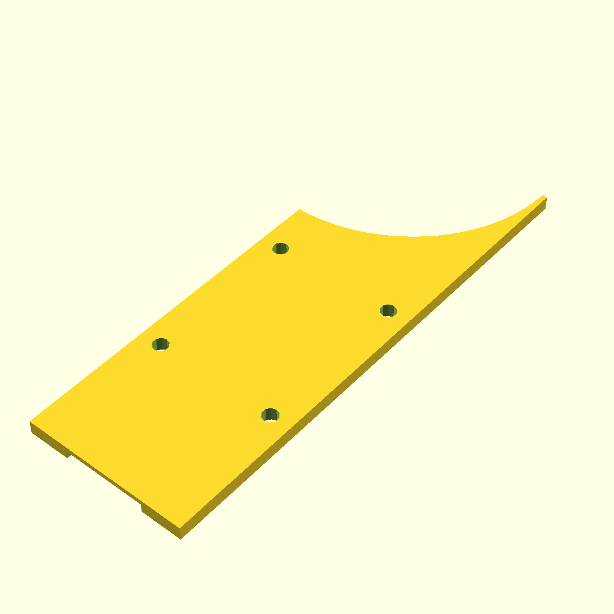

# CatFlap_HA
How to modify a "Sureflap Dualscan" for connecting to Home Assistant

# Features
- Block the flap for outgoing on certain times.
- Block the flap for outgoing by a Vet-Switch (in HA).
- Cats can always come in.
- A blinking LED tells the cats the flap is blocked.
- A buzzer also tells that the flap is blocked if they try.
- AC Powersupply to save on batteries
- Batteries can be used as a fallback in case of a power outage, but then the HA-Connection does not work.

# Missing
- No logging of the chip numbers.
	That might be possible, but I did not implement it.

# Why modifing the "Sureflap Dualscan"?
Well, Petcare builds very fine cat flaps, but if you want to connect to a
 smart home solution, then you have to buy a different flap (Sureflap Connect + a Hub).
 That alone would be not the issue, but it is a "cloud only solution" - something that 
 never ever comes into my house.

 It would be fairly easy for Petcare to produce a flap with Zigbee or another open protocol. However they do not seem to be interested in that. (And they miss the 20,000 new HA installations per Month - how many own a cat?).

# CAUTION: Danger for life
The cat flap contain circuits that produce __+100V__ to the coils. So even it is operatated by just 4* 1.5V batteries, it is a dangerous device if opened. You need a solid knowledge on electricity and electronics for this mods.
Therefore I will not describe the kind of tools you need. If you do not know by your own, don't even try to open the flap.

# Disclaimer
The author assumes no responsibility or liability for any errors or omissions in the content of this site. The information contained in this site is provided on an "as is" basis with no guarantees of completeness, accuracy, usefulness or timeliness.

# Pictures
You can find a few more pictures of the PCB in assets/pictures.

# Status
Finished, installed and used by my girls.

# Finding the right connections
I analyzed the PCB to get the connections for the mod.

# Schematics

# 3d printed housing

# Final Installation

